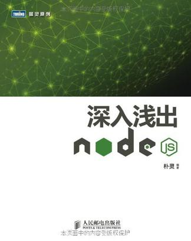

# 如何提高代码质量

## 基本原则

- 代码不是私人的, 是公共财产
- 程序员大部分时间是在阅读代码
- 写代码要保证可读性, 尽量降低思维负担

## 扎实基础

- 对语言特性的理解
- 专业背景知识的掌握
- 数据结构和算法
- 设计模式和原则

下面是个人觉得实用的入门资料:

## 模仿优秀的代码

## 再忙, 停下来, 多总结, 多思考

## 代码标准

- [clean-code-typescript](https://github.com/labs42io/clean-code-typescript)

## 强类型检测(针对动态语言)

- typescript

## 自动检测

- 代码规范检查 - 包括风格规范、实践规范、业务规范
- 重复率 - 重复出现的代码区块占比，通常要求在5%以下
- 复杂度 - 总行数，模块大小，循环复杂度等
- 检查覆盖度 - 经过检查的行数占代码库总行数的比例
- tslint + sonar + jenkins

## 想好再写

## 善用开源

## 持续重构

## 代码审查

## 单元测试

## 充分自测

## 技术升级

## 流程标准

- git flow·改
