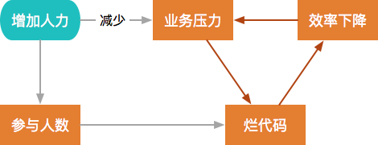
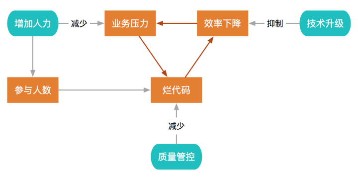

# 为什么需要好的代码质量

## 背景: 熵增定律

> 在无外力影响的情况下，烂代码只会原来越多。

> 为了维持系统有序，需要外界向系统不断输入能量

## 从组织/团体角度上讲

> 烂代码产生的常见原因是业务压力大，导致没有时间或意愿讲究代码质量。因为向业务压力妥协而生产烂代码之后，开发效率会随之下降，导致业务压力更大，形成一种典型的恶性循环。

> 为了应对业务压力，常见的做法就是向项目中增加人力，但是单纯地增加人力的话，会因为风格不一致、沟通成本上升等原因导致烂代码更多。

> 要遏制这种恶性循环，需要多管齐下，主动对代码质量进行管控，并且持续进行技术升级，系统性地解决问题。

现实中实际上很多情况是这样: 质量不够, 人力来凑。
这招确实有效, 毕竟初期要抢占市场, 必须要快, 毕竟有些项目总共也存活不了多长时间。

然而人力只能在一定程度上解决问题。
人力是有限的，也不太可能在短时间内爆发, 而业务的发展就不受控制了。

当人力增加跟不上业务发展的时候，就不是一个好坏的问题了, 是无和有的问题。这个时条件允许的话只能重构/推倒重来, 否则积重难返, 项目就回天乏术了。

每个项目都有自己的生命周期, 烂代码越多, 越离崩解不远了。

有人会说靠更新架构支撑业务发展, 这个当然没错, 然而这建立在良性循环、条件、成本之上, 并不是万能的。

## 从个人角度上讲

- 好的代码, 容易理解/掌握, 情绪可以保持稳定

- 好的代码, 容易修改/扩展, 效率高, 少加班

- 好的代码, 容易定位bug, 故障少, 少挨喷

- 好的代码, 让人信赖, 更有机会负责更大的事

总结: 保命保平安, 有前途

我之前曾经接手一个IM项目, 当时的情景是这样:

- 1 开发新功能困难, 进度慢, 不能支撑业务发展
- 2 四处冒烟, 出了bug难定位, 很多蜜汁bug
- 3 开发本人都不清楚自己写过的功能都有啥逻辑
- 4 完美的实践了怎么写出无法维护代码的准则

最后没有办法, 只能抽丝剥茧, 一块块拆, 重新设计和重构, 耗费了大量成本填补技术债务，那就是另外一个关于如何重构的故事了。

